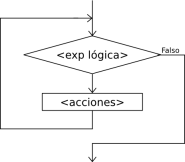

# Estructuras repetitivas: Mientras

La instrucción `Mientras` ejecuta una secuencia de instrucciones mientras una condición sea verdadera.

    Mientras <condición> Hacer
        <instrucciones>
    FinMientras

* Al ejecutarse esta instrucción, la condición es evaluada. Si la condición resulta verdadera, se ejecuta una vez la secuencia de instrucciones que forman el cuerpo del ciclo. Al finalizar la ejecución del cuerpo del ciclo se vuelve a evaluar la condición y, si es verdadera, la ejecución se repite. Estos pasos se repiten mientras la condición sea verdadera.
* Se puede dar la circunstancia que las instrucciones del bucle no se ejecuten nunca, si al evaluar por primera vez la condición resulta ser falsa.
* Si la condición siempre es verdadera, al ejecutar esta instrucción se produce un ciclo infinito. A fin de evitarlo, las instrucciones del cuerpo del ciclo deben contener alguna instrucción que modifique la o las variables involucradas en la condición, de modo que ésta sea falsificada en algún momento y así finalice la ejecución del ciclo.

## Ejemplo:

Crea un programa que pida al usuario una contraseña, de forma repetitiva mientras que no introduzca "asdasd". Cuando finalmente escriba la contraseña correcta, se le dirá "Bienvenido" y terminará el programa.

	Proceso login
		Definir secreto, clave como cadena;
		secreto <- "asdasd";
		Escribir "Dime la clave:";
		Leer clave;
		Mientras clave<>secreto Hacer
			Escribir "Clave incorrecta!!!";
			Escribir "Dime la clave:";
			Leer clave;
		FinMientras
		Escribir "Bienvenido!!!";
		Escribir "Programa terminado";
	FinProceso